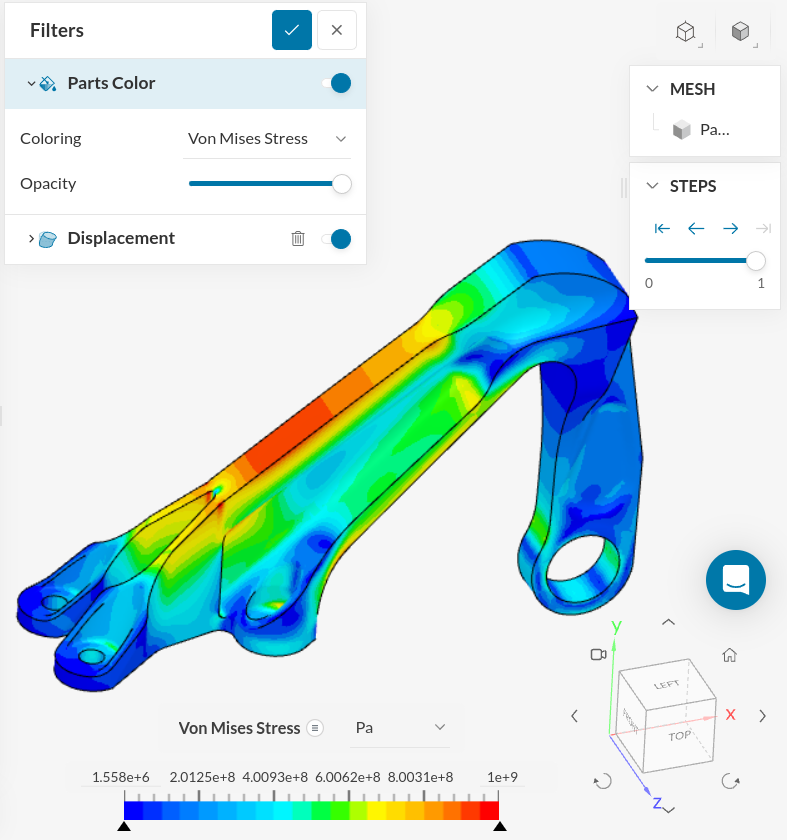

### Aero Bracket

This dataset was downloaded from the [public datasets](https://www.simscale.com/projects/) from [SimScale](https://www.simscale.com/).



This project demonstrates the static stress analysis of three aircraft engine
bearing bracket models considering both linear and nonlinear material
definition. The models are tested with horizontal and vertical loading
conditions as provided on the [GrabCAD - Airplane Bearing Bracket Challenge](https://grabcad.com/challenges/airplane-bearing-bracket-challenge/entries).


#### Data Acquisition and Reduction

The static stress analysis of the bracket was compressed with:

```py
import pyvista
import numpy as np

ii = 1
mesh = pyvista.read(f'./sim_{ii}/sim_{ii}_0_0.vtu')
mesh.points = mesh.points.astype(np.float32)
mesh.cell_data.clear()
for key in mesh.point_data.keys():
    mesh[key] = mesh[key].astype(np.float32)

mout = pyvista.read('aero_bracket.vtu')
```
