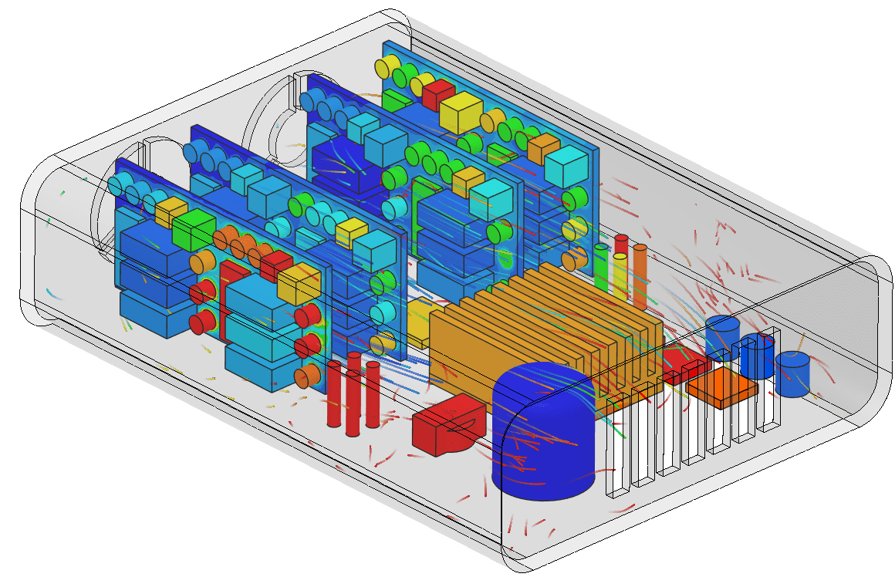

### 

This dataset comes from SimScale's [Thermal Management Tutorial: CHT Analysis of an Electronics Box](https://www.simscale.com/docs/tutorials/thermal-management-cht-analysis-electronics-box/).



#### Data Setup

Data was obtained from their public examples and post-processed from 400 MB (zipped) to around 50 MB zipped.

```py
import pyvista as pv

reader = pv.OpenFOAMReader('./case.foam')
reader.set_active_time_value(1000)
out = reader.read()

comb = out.combine()

ds = out[2:].copy()
ds[35] = ds[35][0].clip(normal='z', value=0.01)

structure = ds.combine().extract_surface(pass_pointid=False, pass_cellid=False)
air = out[1][0]
air.cell_data.clear()
air.point_data.pop('p_rgh')

# save
structure.save('structure.vtp')
air.save('air.vtu')
```
