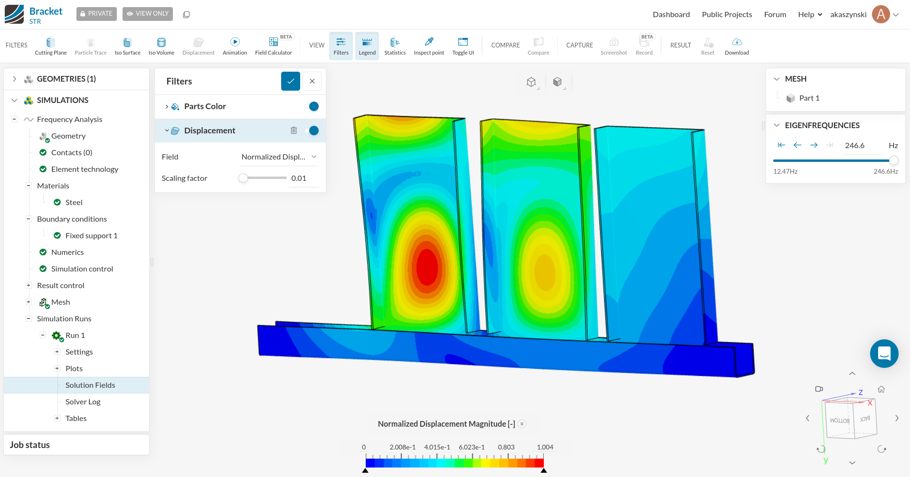

### Pump Bracket

This dataset was downloaded from the [public datasets](https://www.simscale.com/projects/) from [SimScale](https://www.simscale.com/).




#### Data Acquition and Reduction

The [pump bracket project](https://www.simscale.com/projects/STR/bracket/) contains a modal analysis of the bracket. The result dataset was downloaded and the resuting file structure was:

```
$ unzip Bracket-Frequency_Analysis-Run_1-SOLUTION_FIELDS.zip
$ ls -R Bracket-Frequency_Analysis-Run_1-SOLUTION_FIELDS
```

```
.:
case.pvd
sim_0
sim_0.vtm
sim_1
sim_1.vtm
sim_2
sim_2.vtm
sim_3
sim_3.vtm
sim_4
sim_4.vtm
sim_5
sim_5.vtm
sim_6
sim_6.vtm
sim_7
sim_7.vtm
sim_8
sim_8.vtm
sim_9
sim_9.vtm

./sim_0:
sim_0_0_0.vtu

./sim_1:
sim_1_0_0.vtu

./sim_2:
sim_2_0_0.vtu

./sim_3:
sim_3_0_0.vtu

./sim_4:
sim_4_0_0.vtu

./sim_5:
sim_5_0_0.vtu

./sim_6:
sim_6_0_0.vtu

./sim_7:
sim_7_0_0.vtu

./sim_8:
sim_8_0_0.vtu

./sim_9:
sim_9_0_0.vtu
```

Since the geometry is identical between each run, it was possible to reduce the
zipped dataset size from 109 MB to 34 MB while improving the load speed with:

```py
import numpy as np
import pyvista as pv

# load the geometry
ugrid_base = pv.read('./sim_1/sim_1_0_0.vtu')
ugrid_base.points = ugrid_base.points.astype(np.float32)
ugrid_base.clear_data()

# populate the modal solution for each result
for ii in range(10):
    ugrid = pv.read(f'./sim_{ii}/sim_{ii}_0_0.vtu')
    ugrid_base[f'disp_{ii}'] = ugrid.point_data['displacement normalized'].astype(np.float32)

# save
ugrid_base.save('pump_bracket.vtk')

```

This file was subsequently zipped with:

```
zip pump_bracket.zip pump_bracket.vtk
```


#### License

Licensing for this dataset is granted to freely and without restriction
reproduce, distribute, publish according to the [SimScale Terms and
Conditions](https://www.simscale.com/terms-and-conditions/)
