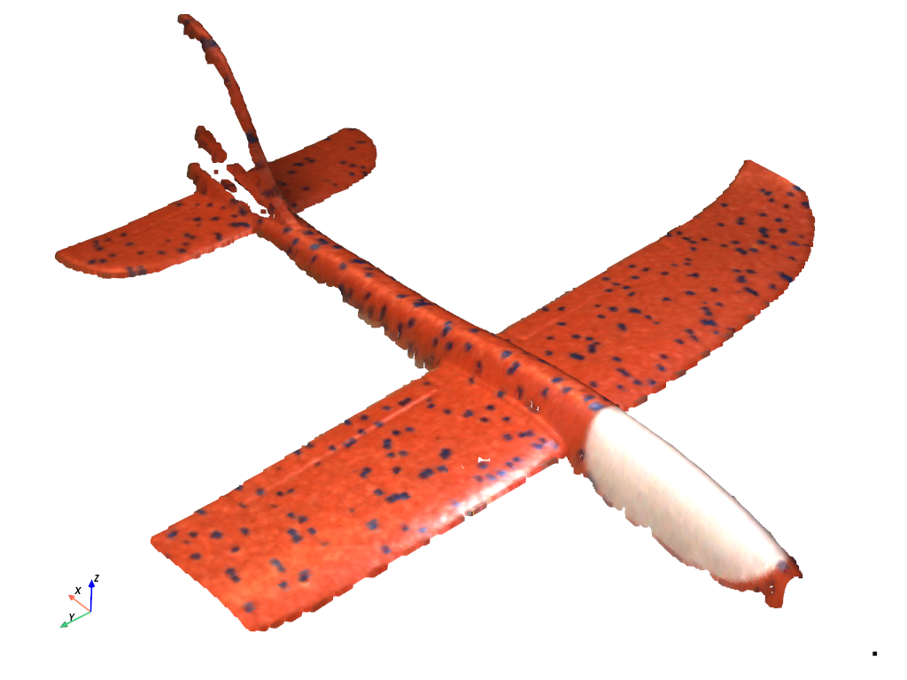

## Photoneo PLY Point Cloud

Point cloud of a toy airplane from Photoneo 3D scanner.

Used to demonstrate usage within pyminiply

```py
import requests, zipfile, tempfile
import pyminiply

url = "https://github.com/pyvista/vtk-data/raw/main/Data/toy-plane-point-cloud/toy-plane.zip"

# download the file using requests
with tempfile.TemporaryDirectory() as tmpdir:
    request = requests.get(url)
    zip_path = f"{tmpdir}/toy-plane.zip"
    with open(zip_path, "wb") as fid:
        fid.write(request.content)
    with zipfile.ZipFile(zip_path, "r") as zfid:
        zfid.extractall(tmpdir)

    # load using pyminiply
    vertices, _, _, _, color = pyminiply.read(f"{tmpdir}/toy-plane.ply")

# optionally plot using pyvista
import pyvista as pv

pset = pv.PointSet(vertices)
pset['color'] = color
pset.plot(rgb=True)

```



### License

Licensed under CC BY 4.0
https://creativecommons.org/licenses/by/4.0/

Permission given by @WouterB15.
